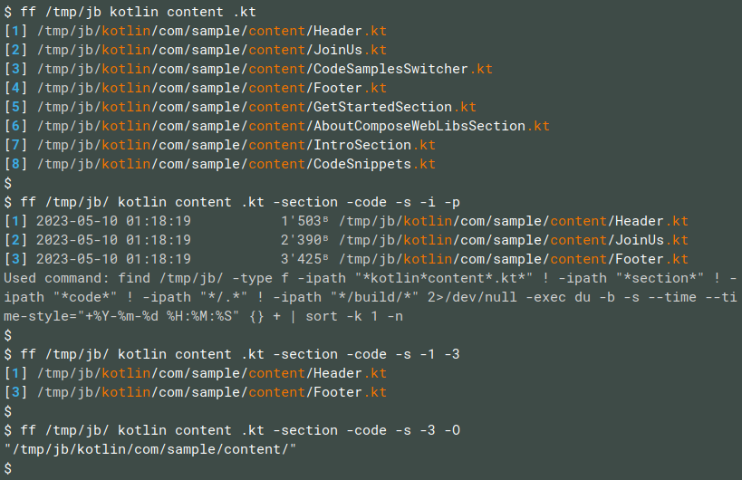

# FindFile

File search util for command line, used similarly to online search engines



## Features

* Search query structure: `include` `words` and `-exclude` `-these` `-ones`
* Included words are highlighted in results
* Including words in sequence by default, and optionally in any order
* Results are numbered. Pass numbers of results to open them
* Can open containing folders of results
* Hidden files and build folders are excluded by default
* Can show equivalent `find` command
* Less visually important text is grayed out


## Usage

### Reference

```
    Searches files containing given path parts, in ~ by default.
    Excludes results containing any of path parts with leading dashes.
    Shows results in a numbered list of full paths.
    Can open results by given numbers. Mind that results may change.
    * Asterisks around path parts are optional, are used automatically.
    Directories to search in, excluded parts and result numbers are optional.
    Default directory can be set in FF_DEFAULT_DIR environment variable.
    Use keys separately, like -p -i -n (-pin is excluded as a path part).
Usage:
    ff <include>
    ff <dir> <dir> <include> <include> -<exclude> -<exclude> - <result_number>
Sort keys (one at a time):
    -n (-N): sort by  name           a to Z        (Z to a)
    -s (-S): sort by  size           small to big  (big to small)
    -m (-M): sort by  modified time  new to old    (old to new, default)
Filter keys:
    -a: include all hidden files, hidden and build directories
    -r: include reordered path parts to search, not only in given order
Open keys:
    -f: file manager to be used to open directory containing result file
Info keys:
    -i: info  about      modified times and sizes in front of results
    -p: print underlying find command
    -h: help  information
```


## Installation

### Linux, option 1: install to /bin

```sh
git clone https://github.com/alex-vt/FindFile.git
cd FindFile/
./gradlew build
sudo cp build/bin/native/releaseExecutable/FindFile.kexe /bin/ff
```

### Linux, option 2: use alias

```sh
git clone https://github.com/alex-vt/FindFile.git
cd FindFile/
./gradlew build
echo "alias ff='$PWD/build/bin/native/releaseExecutable/FindFile.kexe'" >> ~/.bashrc
```

Restart terminals for `ff` to take effect.


## License

[MIT](LICENSE)
